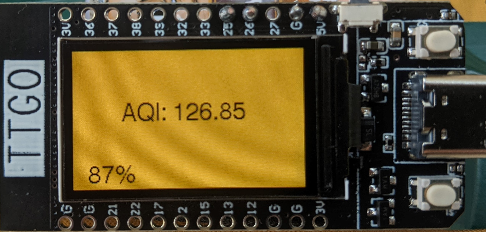
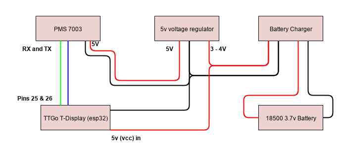

# This is a work in progress for a simple, portable smoke monitor.

## Hardware
The monitor is based around a Plantower PMS 7003 air sensor (~$14 on Aliexpress, ~$30 on Amazon).

Any Plantower sensor should work, but they're roughly the same price and the 7003 is the latest (as of the time of writing).

The other pieces are:
   * 18500 LiPo 3.7v Battery (~$3)
   * HiLetGo Battery Charge IC (or any other charge regulator with over and under charge protection) (~$2)
   * 5v voltage regulator (to lift the 3.7v voltage up to the 5v that the PMS 7003 requires) (~$2)
   * Lilygo TT-Go T-display (esp32 microcontroller + OLED display) (~$20)
### Wiring
Wire the battery into B+/B- on the battery charger, wire the output of the battery charger to both the Vin/Gnd of the T-display as well as the Vin/Gnd on the 5v voltage regulator. Wire Vout/Gnd of the voltage regulator to Vin/Gnd on the PMS 7003. Wire Rx and Tx from the PMS 7003 to Pins 25 (Tx) and 26 (Rx) on the T-display. The choice of pins 25 and 26 are semi-arbitrary, you can use other pins if you want, but you'll need to modify the source code to select those pins.

### Case
I used an old mint container for a case (photos coming soon) but any small project case should work. You'll want to cut
a hole in the case to get airflow into the sensor.

## Software
You can find the softare in the `src` directory. It expects to be used with VS Code that has the Arduino tools configured. It should work with the Arduino IDE also.

To launch VS Code: `cd src; code .`

### Installing
Once you are wired up, connect your T-display to your computer over USB and run `ctrl-p` -> `Arduino: upload`
This should install the software and you should see the air quality on the screen.

### Exploring the software
The software is a work in progress, but current functionality has three displays, you can navigate through these displays with the upper button on the T-display. The three displays are:

* The current air quality
* WiFi status
* History of air quality (last 30 seconds)

Some of the screens have multiple views which are accessed by clicking the lower button on the T-display. If you
click the button on the current air quality screen it will switch between raw PM 2.5 and US EPA Air Quality Index (AQI).
You can find the AQI calculation in `aqi.cpp`, it's not quite exact but it's close.

If you click the botton on the Wifi screen, it will activate a wifi hotspot that will enable you to access the sensor over Wifi. Once you activate the wifi, the Wifi screen will display the connection details. The wifi server has two working URLs:

* `/index.html` gives you the current air quality data in HTML
* `/api` gives you a JSON representation of the current air quality.

## Contributing
* Found a bug? Report it!
* Need a feature? Ask for it!
* Want to contribute code? Go for it!

